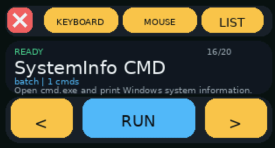
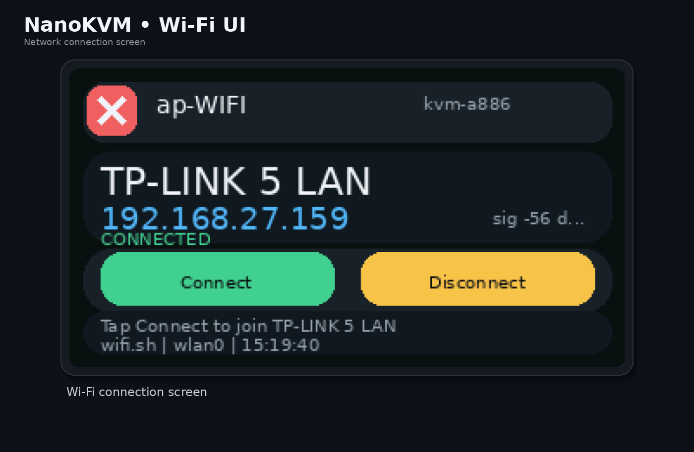
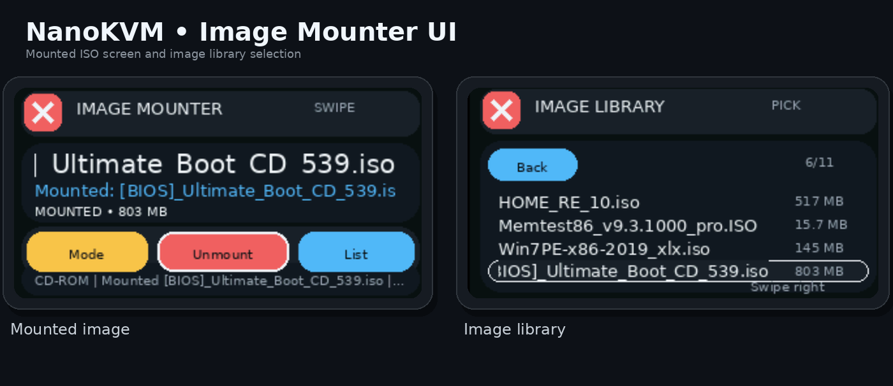
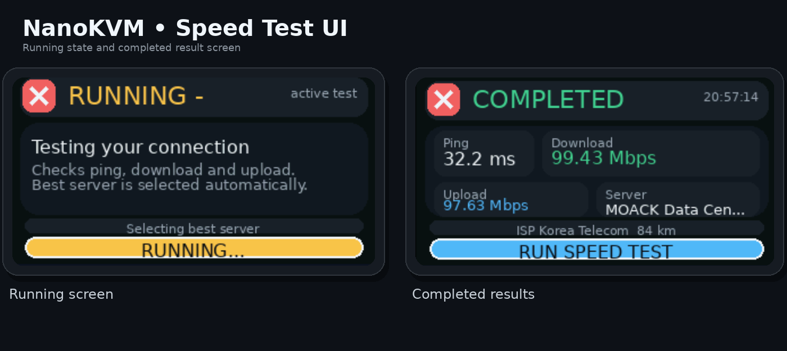
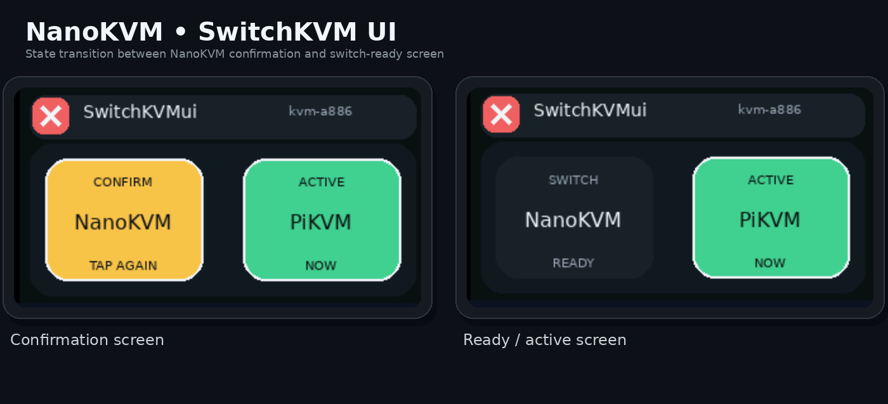
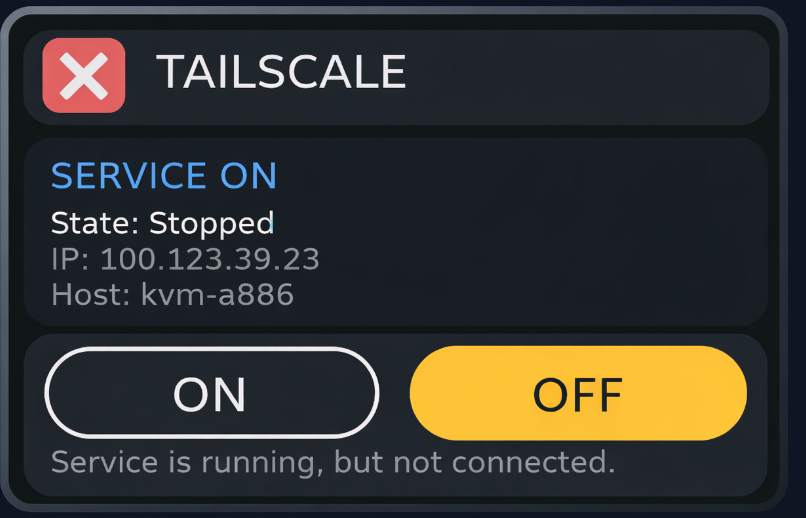

<h1 align="center">NanoKVM Pro DIY Apps</h1>

<p align="center">
  
  
  
  <a href="https://wiki.sipeed.com/hardware/en/kvm/NanoKVM_Pro/introduction.html">
    
  </a>
</p>

<p align="center">
  A curated collection of standalone touch-friendly apps for <strong>NanoKVM Pro</strong>.
</p>

<p align="center">
  These mini apps extend the built-in NanoKVM Pro screen with practical controls for Wi-Fi, virtual media, KVM switching, HID automation, network testing, and service toggles.
</p>

<p align="center">
  
</p>

## App Hub Repo Format

This repository now includes an APP Hub compatible layout based on the official `sipeed/NanoKVM-UserApps` format:

- `apps/<app-name>/...`
- `scripts/apps.toml`

The `scripts/apps.toml` index is the manifest file for the NanoKVM APP catalog, and `scripts/install-userapp.sh` is the direct installer used from NanoKVM shell.

## Install Over SSH

Current NanoKVM Pro firmware hardcodes the public APP Hub source, so the practical way to install this catalog today is over SSH.

Install all apps directly on NanoKVM:

```sh
curl -fsSL https://raw.githubusercontent.com/vadlike/NanoKVM-Pro-DIY-APPS/main/scripts/install-userapp.sh | sh -s -- all
```

Install one app only:

```sh
curl -fsSL https://raw.githubusercontent.com/vadlike/NanoKVM-Pro-DIY-APPS/main/scripts/install-userapp.sh | sh -s -- kvm-pilot
```

The installer:

- downloads the selected revision of this GitHub repository
- installs apps into `/userapp`
- preserves an existing `config.json` if the app already had one
- stores the previous version under `/userapp/.install-backup`

If an app includes `config.json`, it is installed as a starter template. You still need to edit the values manually on NanoKVM for your own environment.

## What Is Inside

Each app package contains:

- `main.py`
- `app.toml`
- preview image or animation

The apps are designed for the NanoKVM Pro touchscreen and focus on fast local actions without needing to open the web UI for every small task.

Apps that need local settings already include a safe starter `config.json` in the repository.

## App Gallery

<table>
  <tr>
    <td align="center" width="50%">
      <strong>ap-WIFI</strong><br>
      
    </td>
    <td align="center" width="50%">
      <strong>image-mounter</strong><br>
      
    </td>
  </tr>
  <tr>
    <td align="center" width="50%">
      <strong>kvm-pilot</strong><br>
      
    </td>
    <td align="center" width="50%">
      <strong>speedtest</strong><br>
      
    </td>
  </tr>
  <tr>
    <td align="center" width="50%">
      <strong>SwitchKVMui</strong><br>
      
    </td>
    <td align="center" width="50%">
      <strong>tailscale-toggle</strong><br>
      
    </td>
  </tr>
  <tr>
    <td align="center" colspan="2">
      <strong>virtual-disk-switch</strong><br>
      
    </td>
  </tr>
</table>

## Included Apps

### `ap-WIFI`

<p align="center">
  
</p>

Connect NanoKVM Pro to a predefined Wi-Fi access point directly from the built-in display.

- Reads target SSID and password from `config.json`
- The repository already includes a starter `config.json`, but you must manually enter your own Wi-Fi values on the device
- Uses the local Wi-Fi stack to connect or disconnect without leaving the device UI
- Shows current connection state, SSID, signal information, and network details on screen

Best use case: quick recovery when you want NanoKVM Pro to rejoin a known wireless network without SSH or browser access.

### `image-mounter`

<p align="center">
  
</p>

Mount ISO, IMG, and EFI payloads from `/data` as virtual media on NanoKVM Pro.

- Browses locally stored images and mounts them through the NanoKVM API
- Includes a starter `config.json`; if needed, update the NanoKVM login credentials in it manually
- Supports virtual CD-ROM / mass-storage style workflows
- Can wrap `.efi` payloads into a bootable FAT image automatically for easier UEFI boot scenarios

Best use case: boot installers, diagnostics, firmware tools, or custom EFI payloads without manually handling the web panel every time.

### `kvm-pilot`

<p align="center">
  
</p>

Turn NanoKVM Pro into a compact touch control center for HID injection, keyboard shortcuts, mouse actions, and scripted automation.

- Executes DuckyScript, batch files, PowerShell snippets, and launch commands from the local `scripts` folder
- Includes practical samples like `ctrl_alt_delete`, `reboot_to_bios`, `ipconfig`, `systeminfo`, and more
- Provides on-device keyboard, mouse, touchpad, media keys, and BIOS-oriented quick actions

Best use case: remote maintenance, OS installation flows, BIOS navigation, or fast repetitive actions on the target machine.

### `speedtest`

<p align="center">
  
</p>

Run a network speed test directly on NanoKVM Pro and view the result on the local display.

- Measures ping, download, and upload
- Shows server and connection information in a compact on-device UI
- Useful for checking uplink quality before relying on remote access sessions

Best use case: confirm that the NanoKVM network path is healthy before troubleshooting latency, streaming quality, or access issues.

### `SwitchKVMui`

<p align="center">
  
</p>

Switch the local device role between NanoKVM and PiKVM using the built-in touchscreen.

- Detects the active side and presents a local selector
- Stores the selected target and requests a reboot to apply the change
- Designed for dual-role setups where a fast local toggle matters more than a shell command

Best use case: a hybrid NanoKVM/PiKVM environment where the device is repurposed locally depending on the task.

### `tailscale-toggle`

<p align="center">
  
</p>

Enable or disable Tailscale from the NanoKVM Pro touchscreen without opening a terminal.

- Checks whether Tailscale is installed, running, and connected
- Calls `tailscale up` and `tailscale down` from a simple on-device interface
- Surfaces state, connectivity, and version information in a compact status view

Best use case: quickly bring secure remote access online or take it offline directly from the device.

### `virtual-disk-switch`

<p align="center">
  
</p>

Switch the Virtual Disk source between disabled mode, internal eMMC, and SD card.

- Toggles the underlying USB disk flags used by NanoKVM Pro
- Lets you swap storage source without manually editing system files
- Restarts the USB device helper so the new mode is applied locally

Best use case: expose the right backing storage to the host system in a few taps during imaging, maintenance, or file transfer workflows.

## Why This Repository

This repository is focused on small, practical apps that make NanoKVM Pro more useful as a self-contained hardware tool. The goal is simple: keep common admin actions available on the device itself, directly on the touchscreen.

## Repository Layout

```text
apps/
  ap-WIFI/
  image-mounter/
  kvm-pilot/
  speedtest/
  SwitchKVMui/
  tailscale-toggle/
  virtual-disk-switch/
scripts/
  apps.toml
  install-userapp.sh
```

Each directory inside `apps/` is an independent mini app, `scripts/apps.toml` is the catalog manifest, and `scripts/install-userapp.sh` is the installer entry point.
